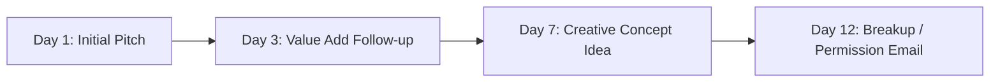

# 🚀 Creator Orbit — Brand Outreach Playbook (Month 1)

> **Agency Founders**: Vedant Rai & Manya Jain  
> **Agency Value Proposition**: Direct-access creator network of 4,300+ creators across India with zero middlemen markup, verified metrics, and end-to-end execution.

---

## 📋 Table of Contents
1. [Target Prospect Persona & Where to Find Them](#1-target-prospect-persona)
2. [Cold Email Templates (3 High-Converting Angles)](#2-cold-email-templates)
3. [LinkedIn Outreach (Connection Note + First Message)](#3-linkedin-outreach)
4. [Instagram DM Scripts (Quick & Visual)](#4-instagram-dm-scripts)
5. [The 4-Touch Follow-Up Sequence](#5-the-4-touch-follow-up-sequence)
6. [Objection Handling Playbook](#6-objection-handling-playbook)
7. [Niche-Specific Customizations](#7-niche-specific-customizations)

---

## 1. Target Prospect Persona

### Who to Reach Out To:
| Priority | Title / Role | Why Them? |
|---|---|---|
| **Tier 1 (Best)** | Founder / Co-Founder / CEO (Seed to Series A D2C Brands) | Quickest decision maker; cares about immediate sales & CAC reduction. |
| **Tier 2** | Head of Marketing / Growth Marketing Lead | Evaluates based on expected views, CPV (Cost Per View), and content quality. |
| **Tier 3** | Influencer Marketing Manager / Brand Manager | Overwhelmed with creator coordination; wants ready rosters and reliable delivery. |

### Where to Find 20–30 Leads Daily:
1. **Instagram**: Search hashtags like `#D2CIndia`, `#MadeInIndia`, `#CleanBeautyIndia`, `#IndianSkincare`, `#ActivewearIndia`. Check who is sponsoring creators in your niche.
2. **Shark Tank India Brands**: Check past pitchers (Seasons 1–4) — almost all are heavily scaling D2C.
3. **LinkedIn**: Search `"Founder" AND "D2C" AND "India"` or `"Head of Marketing" AND "Beauty/Fitness"`.
4. **Inc42 / YourStory**: Look for recently funded D2C brands (Seed, Pre-Series A).

---

## 2. Cold Email Templates

### Angle A: The "Pre-Shortlisted Creators" Pitch (Highest Conversion)
*Best for: Skincare, Beauty, Fashion, Fitness D2C brands.*

```text
Subject: 10 shortlisted creators for [Brand Name] (250K+ targeted views)

Hi [First Name],

Came across [Brand Name]'s recent campaign for [Product Name] — really loved the angle around [mention 1 specific detail, e.g., the clean ingredient positioning / minimalist packaging].

At Creator Orbit, we manage a direct-access network of 4,300+ creators across Tier 1 & Tier 2 India. 

Because we work directly with creators on WhatsApp with zero middlemen agency markups, we put together a quick pilot roster specifically for [Brand Name]:

• 8–10 micro & mid-tier creators (avg. 50K–200K followers, 10%+ engagement)
• Audience: [Target Demographic, e.g., Women 18–32 in Mumbai, Delhi & Bangalore]
• Expected Reach: 200,000–350,000 organic reel views
• All-inclusive pilot budget: Under ₹45,000 (including brief creation, shipping coordination, and usage rights)

Would you be open to reviewing the 1-page creator roster and performance sheet? I can send it over right away.

Best regards,

Vedant Rai & Manya Jain
Co-Founders | Creator Orbit
Phone/WhatsApp: +91 [Your Phone]
Website/Portfolio: [Link / Deck Link]
```

---

### Angle B: The "High CAC / Performance Alternative" Pitch
*Best for: Performance Marketers & Growth Leads spending heavily on Meta Ads.*

```text
Subject: Lowering [Brand Name]'s Meta CAC with creator whitelisting?

Hi [First Name],

With Meta ad CPMs rising across D2C [Niche, e.g., beauty & personal care], most brands we talk to are seeing customer acquisition costs climb 20–35% this quarter.

The brands winning right now aren't running studio ads — they're whitelisting authentic UGC reels from creators with high engagement.

At Creator Orbit, we help D2C brands launch high-converting creator campaigns:
1. We supply 10–15 creator reels tailored specifically for Spark Ads / Partnership ads.
2. Full ad code & usage rights included upfront.
3. Zero markup on creator commercials (direct pricing).

Can I share 2 examples of how similar brands structured their pilot with us to get 3.2x+ blended ROAS?

Best,

Vedant Rai
Co-Founder | Creator Orbit
```

---

### Angle C: The "Hyper-Local / City Blitz" Pitch
*Best for: Brands doing events, quick commerce (Blinkit/Zepto), or retail pushes in specific cities.*

```text
Subject: Hyper-local creator push for [Brand Name] in [City, e.g., Delhi NCR / Mumbai]

Hi [First Name],

Saw that [Brand Name] is expanding distribution / scaling quick commerce availability across [City].

We have over [X00+] verified, active creators based directly in [City] across [Niche] with shipping addresses and direct WhatsApp access ready to go.

We can deploy a 10-creator blitz in [City] within 7 days to drive localized awareness and store/app search volume.

Open to seeing a quick 5-minute media plan for this?

Best,

Manya Jain & Vedant Rai
Creator Orbit
```

---

### Angle D: The "Massive Volume Barter / Product Seeding" Pitch (200 to 1,000+ Creators)
*Best for: Physical D2C brands (Skincare, Beauty, Snacks, Beverages, Fashion) looking to flood Instagram & YouTube with hundreds of organic reviews and unboxing reels.*

```text
Subject: Seeding [Brand Name] with 200–500 creators across India (800K+ organic views)

Hi [First Name],

Loved how [Brand Name] is scaling [Product Name]. If you're looking to generate massive user-generated content (UGC) and dominate social feeds this quarter, we have a ready program for you.

At Creator Orbit, we manage end-to-end **High-Volume Barter & Product Seeding Campaigns**:

• **Scale Options**: 200, 500, or 1,000+ verified creators across India
• **Deliverables per Creator**: 1 Dedicated Reel + 1 Story + 1 YouTube Shorts/Post
• **Expected Reach**: 800K to 2.5M+ organic views (avg. 4K–5K views/creator)
• **End-to-End Management**: We handle 100% of creator shortlisting, shipping address verification, tracking follow-ups, draft monitoring, and post analytics.

All you do is ship the product hampers — our operations team handles the rest.

Would you be open to seeing our 1-page Barter Campaign Overview and package economics?

Best regards,

Vedant Rai & Manya Jain
Co-Founders | Creator Orbit
WhatsApp: +91 [Your Phone] | hello@creatororbit.in
```

---

## 3. LinkedIn Outreach

### Connection Request Note (Max 300 Characters):
> *"Hi [First Name], loved [Brand Name]'s recent growth with [Product]. At Creator Orbit, we manage 4,300+ direct creators across India. Put together a curated pilot roster that matches your target audience — would love to connect and share it!"*

### Message After Connection Acceptance (Send within 2 hours):
> *"Thanks for connecting, [First Name]!*  
> 
> *As mentioned, we’ve pre-filtered 8 creators across [Delhi / Mumbai / Bangalore] whose audiences overlap directly with [Brand Name]'s buyers.*
> 
> *We handle everything end-to-end: creator negotiation, shipping tracking, script briefing, draft approvals, and ad code delivery for under ₹40K–₹50K total.*
> 
> *Can I drop a 1-page PDF roster here for your team to check out?"*

---

## 4. Instagram DM Scripts

*Send from your agency page or founder personal profile directly to the brand's verified Instagram handle.*

```text
Hey team [Brand Name]! 👋

Big fan of what you're building with [Specific Product Name].

We run Creator Orbit — we work directly with 4,300+ verified creators in India across skincare, fitness, and lifestyle.

We just curated a 10-creator pilot roster specifically for [Brand Name] that can generate ~250K+ organic views for under ₹40K (zero agency middlemen markups).

Who is the best person on your growth/marketing team to share the 1-page media plan with? Or can we send it right here? 😊
```

---

## 5. The 4-Touch Follow-Up Sequence

> **Stat**: 70% of agency deals close on Follow-Up #2 or #3. Never stop at 1 email.



### Follow-Up 1 (Day 3 — Soft Nudge + Social Proof)
```text
Subject: Re: 10 shortlisted creators for [Brand Name]

Hi [First Name],

Bumping this to the top of your inbox in case it got buried.

We just updated our [Niche] roster with 5 additional creators who have an average 12.4% engagement rate in Mumbai & Bangalore.

Would love to send over the list — takes 60 seconds to review. 

Best,
Vedant
```

### Follow-Up 2 (Day 7 — Free Creative Campaign Angle)
```text
Subject: Quick creative idea for [Brand Name]'s reels

Hi [First Name],

Had a quick thought for [Brand Name] based on current trending audio formats in [Niche]:

Instead of standard product unboxing, we can run a "Blind Test / 7-Day Challenge" format across 8 micro-creators comparing [Product] against standard market alternatives.

We already have the creator shortlist ready to execute this within 5 business days.

Worth a quick 10-minute chat this week?

Best,
Manya & Vedant
```

### Follow-Up 3 (Day 12 — The "Polite Breakup" Email)
```text
Subject: Closing the loop / [Brand Name]

Hi [First Name],

I assume your marketing calendar is completely full for this month, so I won't keep following up.

If you ever want to run a fast, direct-priced creator campaign or need a quick roster of pre-vetted creators in India, feel free to reach out.

Wishing [Brand Name] continued scale!

Best,
Vedant Rai | Creator Orbit
```

---

## 6. Objection Handling Playbook

### Objection 1: *"We already do influencer marketing in-house."*
> **Your Response**:  
> *"That’s great! Most of our brand partners have in-house teams too. Where we plug in is eliminating the tedious back-and-forth — finding verified addresses, chasing creators for drafts on WhatsApp, and negotiating rates 40% lower than open-market rate cards.*  
> 
> *Think of us as an on-demand sourcing partner. Would you be open to testing us on a small 5-creator batch alongside your in-house campaigns to compare CAC?"*

### Objection 2: *"What is your pricing / agency fee?"*
> **Your Response**:  
> *"We operate on 100% transparent pricing. For our Starter Pilot Package (5–8 creators, ~150K–250K views), the total campaign cost is ₹35,000–₹50,000 all-inclusive (creator payouts + complete briefing, draft QC, and reporting).*  
> 
> *Zero hidden monthly retainers. You only pay per campaign deliverables."*

### Objection 3: *"Send across your portfolio / creator roster first."*
> **Your Response**:  
> *"Attached is our 1-Page Creator Orbit Overview and a sample 8-creator roster tailored for [Brand Niche].*  
> 
> *If you like the creator selection, we can customize the exact roster based on your target city/demographic and have drafts ready within 7 days of confirmation."*

---

## 7. Niche-Specific Customizations

### For Skincare & Beauty Brands:
* **Key Pitch Hook**: *"Authentic texture shots, 7-day before/after routines, and clean ingredient breakdown (no fake scripted ads)."*
* **Target Cities**: Delhi NCR, Mumbai, Bangalore, Pune, Chandigarh.

### For Fitness & Supplement Brands:
* **Key Pitch Hook**: *"Daily workout routine integration, honest macro breakdown, and high-energy reel formats with direct discount promo codes."*
* **Target Cities**: Delhi, Mumbai, Hyderabad, Bengaluru, Kolkata.

### For Fashion & Apparel Brands:
* **Key Pitch Hook**: *"Styling 1 piece 3 ways, 'What I Ordered vs What I Got', and haul reels with direct bio link trackable UTMs."*
* **Target Cities**: Delhi NCR, Mumbai, Jaipur, Bangalore, Pune.
