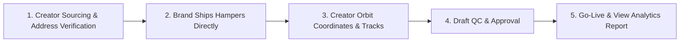

# 🌌 CREATOR ORBIT — Agency Credentials & Pitch Deck
### *"Orbit Beyond Ordinary"*

> **Official Document**: Agency Overview, Campaign Packages & Performance Model  
> **Prepared by**: Vedant Rai (New Delhi) & Manya Jain (Uttarakhand) — Co-Founders  
> **Website**: [https://thecreatororbit.vercel.app/](https://thecreatororbit.vercel.app/)  
> **Contact**: thecreatororbit.media@gmail.com | IG: [@thecreatororbit](https://instagram.com/thecreatororbit)

---

## 🎯 1. Who We Are
**Creator Orbit** is a performance-first influencer marketing and creator intelligence agency based in India. We help D2C, e-commerce, and high-growth consumer brands flood social feeds with high-converting creator content at scale.

**Creator Orbit Selection Core:**  
`Audience Match • Content Quality • Engagement • Budget Fit • Niche Relevance`

### Why Brands Work With Creator Orbit:
```
┌─────────────────────────┬─────────────────────────┬─────────────────────────┐
│  FOUNDER-VETTED ROSTER  │     ORBIT MATCH™        │   SEAMLESS LOGISTICS    │
│  Handpicked creators in │  Signature 5-pillar     │  Clean dispatch sheets  │
│  Indian Beauty, Skincare│  vetting framework for  │  sent to your warehouse │
│  & Lifestyle            │  high-converting content│  for direct product ship│
└─────────────────────────┴─────────────────────────┴─────────────────────────┘
```

---

## 🛡️ 2. The ORBIT MATCH™ Framework
*Our proprietary 5-pillar creator selection system that guarantees zero fake followers, authentic engagement, and maximum brand ROI.*

```
 ┏━━━━━━━━━━━━━━━━━━━━━━━━━━━━━━━━━━━━━━━━━━━━━━━━━━━━━━━━━━━━━━━━━━━━━━━━━━━┓
 ┃  O — Original Content Quality                                             ┃
 ┃      High production aesthetics, authentic storytelling, and organic hooks┃
 ┃                                                                           ┃
 ┃  R — Relevance to Brand                                                   ┃
 ┃      Tight category alignment with your product USP and buyer persona     ┃
 ┃                                                                           ┃
 ┃  B — Brand Safety                                                         ┃
 ┃      Zero copyright issues, verified reputation, and professional conduct ┃
 ┃                                                                           ┃
 ┃  I — Ideal Audience Match                                                 ┃
 ┃      Pinpoint demographic alignment (age, gender, Tier 1/2 city splits)   ┃
 ┃                                                                           ┃
 ┃  T — True Engagement                                                      ┃
 ┃      1.5%–2.0%+ verified organic reach with active comment conversations  ┃
 ┗━━━━━━━━━━━━━━━━━━━━━━━━━━━━━━━━━━━━━━━━━━━━━━━━━━━━━━━━━━━━━━━━━━━━━━━━━━━┛
```

---

## 📊 3. Our Creator Network by Numbers

| Metric | Details |
|---|---|
| **Roster Curation** | **100% Handpicked & Vetted** by Founders Vedant & Manya |
| **Specialization Focus** | Skincare & Beauty (55%), Fitness & Wellness (25%), Fashion & Lifestyle (20%) |
| **Geographic Coverage** | Delhi NCR, Mumbai, Bengaluru, Pune, Hyderabad, Kolkata, Jaipur, Chandigarh + Tier 2 hubs |
| **Campaign Seeding Scale** | **50 to 500+ Creators** per brand campaign |
| **Average Organic Views** | **4,000 – 15,000+ views** per creator reel |
| **Average Engagement Rate** | **1.5% – 2.0%** (Real, verified organic engagement) |
| **Turnaround Time** | **Around 15 Days** from product dispatch to content going live |

---

## ⚙️ 3. How We Execute Your Campaign (Frictionless Logistics)



1. **Creator Recruitment & Address Verification**: We shortlist matching creators and compile 100% verified shipping addresses, phone numbers, and product variant preferences.
2. **Direct Brand Dispatch**: We deliver a standardized dispatch sheet to your logistics/warehouse team. Your brand ships the product hampers directly to the creators (meaning zero warehousing middlemen markups).
3. **Turnkey Coordination**: Our operations team handles all tracking reminders, delivery confirmations, and creator WhatsApp follow-ups.
4. **Draft QC & Compliance**: Every reel draft is verified against brand guidelines, audio copyrights, and key messaging before going live.
5. **Live Monitoring & Analytics**: We deliver a comprehensive live campaign tracker with post URLs, view counts, engagement rates, and raw UGC asset access.

---

## 💰 4. Campaign Packages for Brands

### 🎁 A. Scalable Barter & Product Seeding Programs (OUR HERO OFFERING)

We offer scalable influencer marketing campaigns tailored to different brand requirements and campaign volumes. All barter packages include **end-to-end creator sourcing, address verification, campaign management, and deliverable tracking**.

```
╔══════════════════════════════════════════════════════════════════════════════╗
║  1. STARTER SEEDING PILOT (200+ Creators)                                    ║
║  • Campaign Size: 200+ Creators                                              ║
║  • Deliverables per Creator: 1 IG Reel + 1 Story + 1 YT Shorts (where app.)  ║
║  • Average Expected Views: 4K–5K per creator (800K – 1,000,000+ Total Views) ║
║  • Deliverable Management: Full address sheet + tracking + draft QC          ║
║  • Pricing Scope: Custom Pilot Proposal based on SKU & category              ║
║  • Best for: Product launches & testing creator marketing at scale           ║
╚══════════════════════════════════════════════════════════════════════════════╝

╔══════════════════════════════════════════════════════════════════════════════╗
║  2. GROWTH SEEDING BLITZ (500+ Creators — Most Popular)                      ║
║  • Campaign Size: 500+ Creators                                              ║
║  • Deliverables per Creator: 1 IG Reel + 1 Story + 1 YT Shorts (where app.)  ║
║  • Average Expected Views: 4K–5K per creator (2,000,000 – 2,500,000+ Views)  ║
║  • Deliverable Management: Dedicated operations lead + live dashboard        ║
║  • Pricing Scope: Custom Growth Proposal based on SKU & category             ║
║  • Best for: Strong reach, massive UGC content volume & market penetration   ║
╚══════════════════════════════════════════════════════════════════════════════╝

╔══════════════════════════════════════════════════════════════════════════════╗
║  3. VIRAL CATEGORY DOMINANCE (1,000+ Creators)                               ║
║  • Campaign Size: 1,000+ Creators                                            ║
║  • Deliverables per Creator: 1 IG Reel + 1 Story + 1 YT Shorts (where app.)  ║
║  • Average Expected Views: 4K–5K per creator (4,000,000 – 5,000,000+ Views)  ║
║  • Deliverable Management: Nationwide dispatch sheet + comprehensive report  ║
║  • Pricing Scope: Tailored Scale Proposal based on deliverables & duration   ║
║  • Best for: Large-scale brand awareness, category dominance & viral blitz   ║
╚══════════════════════════════════════════════════════════════════════════════╝
```

> **What We Provide with Every Barter Campaign**:
> * Creator sourcing and shortlisting
> * Campaign strategy and planning
> * End-to-end creator coordination
> * Deliverable management and follow-ups
> * Content tracking and campaign monitoring
> * Performance reporting and campaign insights
> * Dedicated campaign management team

*(Campaign proposals are custom-built depending on creator category, product value, campaign requirements, timelines, and additional deliverables).*

---

### 💎 B. Curated Paid & Whitelisted Creator Packages (For Targeted Scale)

For brands looking for curated creators with guaranteed ad boosting & whitelisting rights:

* **Starter Paid Pilot**: 5–7 Curated Creators | **50K – 200K Views** | **Flexible Pilot Scope**
* **Growth UGC Scaler**: 12–15 Curated Creators (**Micro + Macro Mix**) | **200K+ Views** | **Custom Retainer Scope**
* **Enterprise Campaign**: 25–30+ Creators across India | **1M+ Guaranteed Views** | **Tailored Enterprise Proposal**

---

## 📈 5. Model Comparison: Traditional Agency vs. Creator Orbit

| Campaign Factor | Traditional Agency Model | Creator Orbit Model |
|---|---|---|
| **Creator Commercials** | Agency markups may apply | Transparent creator pricing |
| **Agency Fees** | Monthly retainers may be required | Flexible pay-per-campaign model |
| **Ad Whitelisting Rights** | May involve additional fees | Rights and costs defined upfront |
| **Campaign Cost Efficiency** | Varies by campaign | Optimized for efficient creator spending |

---

## 🤝 6. Simple Terms of Engagement

* **Milestone**: 50% Advance upon campaign sign-off; 50% upon deliverable completion & final report.
* **Turnaround Guarantee**: Drafts submitted within 7 days of product delivery to creator.
* **Content Usage**: 90 days organic digital re-use & reposting rights included.

---

## 📞 7. Ready to Launch Your Campaign?

Let’s launch your 200–500 creator product seeding campaign today.

* **Vedant Rai** | Co-Founder, Business & Operations
* **Manya Jain** | Co-Founder, Creator Relations & Strategy
* **Website**: [https://thecreatororbit.vercel.app/](https://thecreatororbit.vercel.app/)
* **Email**: thecreatororbit.media@gmail.com
* **Instagram**: [@thecreatororbit](https://instagram.com/thecreatororbit)
* **Location**: New Delhi (Vedant) & Uttarakhand (Manya) — Serving Brands Pan-India
