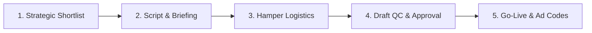

# 🌌 CREATOR ORBIT — Agency Credentials & Pitch Deck

> **Official Document**: Agency Overview, Campaign Packages & Performance Model  
> **Prepared by**: Vedant Rai & Manya Jain (Co-Founders)  
> **Contact**: hello@creatororbit.in | +91-XXXXXXXXXX  

---

## 🎯 1. Who We Are
**Creator Orbit** is a performance-first influencer marketing and creator intelligence agency based in India. We help D2C, e-commerce, and high-growth brands turn creators into their highest-ROI customer acquisition channel.

### Why Brands Work With Us:
```
┌─────────────────────────┬─────────────────────────┬─────────────────────────┐
│   4,300+ DIRECT ROSTER   │   ZERO MIDDLEMEN MARKUP  │   END-TO-END EXECUTION  │
│  Verified Indian creators│  Direct WhatsApp access │  From brief & hampers   │
│   in Beauty, Fitness,   │  means 35-50% lower     │  to drafts, ad codes,   │
│   Fashion & Lifestyle   │  campaign costs for you │  and performance metrics│
└─────────────────────────┴─────────────────────────┴─────────────────────────┘
```

---

## 📊 2. Our Creator Network by Numbers

| Metric | Details |
|---|---|
| **Active Creators Managed** | **4,300+** Curated creators across India |
| **Top Niches** | Skincare & Beauty (45%), Fitness & Wellness (25%), Fashion (20%), Lifestyle/Tech (10%) |
| **Geographic Coverage** | Delhi NCR, Mumbai, Bengaluru, Pune, Hyderabad, Kolkata, Jaipur, Chandigarh + Tier 2 hubs |
| **Average Engagement Rate** | **6.8% – 14.2%** (Industry benchmark is 2.5%–4%) |
| **Turnaround Time** | **7–10 Days** from contract signing to content going live |

---

## 🛠️ 3. What We Do (Full-Service Campaign Delivery)



1. **Precision Matching**: We filter creators based on past view consistency, genuine engagement (no bot followers), and audience demographic fit.
2. **High-Converting Angle Briefs**: We write creator briefs tailored for conversions (hook variations, 3-second retention, before/after formats, clear CTA).
3. **Logistics & Gifting**: We manage 100% of address verification, sample hamper dispatch, and delivery tracking.
4. **Draft QC & Approval**: Every draft is reviewed for brand safety, audio copyright, and brief compliance before you see it.
5. **Whitelisting & Ad Codes**: We deliver Meta Partnership Ad codes so you can scale winning creator reels as paid ads.

---

## 💰 4. Campaign Packages for Brands

### A. High-Impact Paid & Whitelisted Packages (Curated Creators)

```
╔══════════════════════════════════════════════════════════════════════════════╗
║  PACKAGE 1: STARTER PILOT (Test & Validate)                                  ║
║  • 5–7 Curated Nano/Micro Creators                                           ║
║  • Estimated Reach: 150,000 – 250,000 Organic Views                          ║
║  • Deliverables: 5–7 Dedicated Reels + Story Links + Meta Ad Codes           ║
║  • Ideal For: Testing a new product launch or creator marketing channel      ║
║  • Budget: ₹35,000 – ₹50,000 (All-inclusive)                                 ║
╚══════════════════════════════════════════════════════════════════════════════╝

╔══════════════════════════════════════════════════════════════════════════════╗
║  PACKAGE 2: GROWTH SCALER (Most Popular)                                     ║
║  • 12–15 Curated Creators (Micro + Mid-Tier Mix)                              ║
║  • Estimated Reach: 450,000 – 750,000 Organic Views                          ║
║  • Deliverables: 15 Reels + 30 Stories + Whitelisting Rights + Performance Rep║
║  • Ideal For: Scaling monthly customer acquisition & brand search volume     ║
║  • Budget: ₹85,000 – ₹1,25,000 (All-inclusive)                               ║
╚══════════════════════════════════════════════════════════════════════════════╝

╔══════════════════════════════════════════════════════════════════════════════╗
║  PACKAGE 3: VIRAL BLITZ & SCALING                                            ║
║  • 25–30 Creators across Tier 1 & Tier 2 Cities                              ║
║  • Estimated Reach: 1,200,000 – 2,000,000+ Views                             ║
║  • Deliverables: Multi-format (Instagram Reels + YouTube Shorts)             ║
║  • Ideal For: Major sale events, festive campaigns, or category dominance    ║
║  • Budget: ₹2,20,000 – ₹3,50,000 (All-inclusive)                             ║
╚══════════════════════════════════════════════════════════════════════════════╝
```

---

### B. High-Volume Barter & Product Seeding Packages (Scale UGC & Awareness)

We offer scalable influencer marketing campaigns tailored to different brand requirements and campaign volumes. All barter packages include **end-to-end creator sourcing, coordination, address verification, campaign management, and deliverable tracking**.

#### 1. 200+ Creator Campaign
* **Campaign Size**: 200+ Creators
* **Deliverables per Creator**:
  * 1 Instagram Reel
  * 1 YouTube Post/Shorts (where applicable)
  * 1 Static Instagram Story
* **Average Expected Views**: 4K–5K per creator (**800K – 1,000,000+ Total Views**)
* **Estimated Campaign Budget**: **₹2,75,000 – ₹3,00,000**
* **Best for**: Product launches, targeted awareness campaigns, and brands looking to test influencer marketing at scale.

#### 2. 500+ Creator Campaign
* **Campaign Size**: 500+ Creators
* **Deliverables per Creator**:
  * 1 Instagram Reel
  * 1 YouTube Post/Shorts (where applicable)
  * 1 Static Instagram Story
* **Average Expected Views**: 4K–5K per creator (**2,000,000 – 2,500,000+ Total Views**)
* **Estimated Campaign Budget**: **₹3,50,000 – ₹4,00,000**
* **Best for**: Brands aiming for stronger reach, massive UGC content volume, and wider audience penetration.

#### 3. 1,000+ Creator Campaign
* **Campaign Size**: 1,000+ Creators
* **Deliverables per Creator**:
  * 1 Instagram Reel
  * 1 YouTube Post/Shorts (where applicable)
  * 1 Static Instagram Story
* **Average Expected Views**: 4K–5K per creator (**4,000,000 – 5,000,000+ Total Views**)
* **Estimated Campaign Budget**: **₹9,00,000 – ₹10,00,000**
* **Best for**: Large-scale brand awareness, nationwide product seeding, viral category dominance, and maximum creator-led visibility.

> **What We Provide with Every Barter Campaign**:
> * Full creator sourcing, vetting, and shortlisting
> * Campaign strategy, angles, and content guidelines
> * End-to-end shipping address verification & dispatch coordination
> * Creator follow-ups, timeline tracking, and reminder workflows
> * Content quality check and link monitoring
> * Final campaign performance report and view analytics
> * Dedicated campaign management lead

*(Campaign budgets may vary depending on creator category, product value, campaign requirements, timelines, and additional deliverables).*

---

## 📈 5. Sample Campaign Economics (Why Direct Pricing Wins)

| Factor | Traditional Agency | Creator Orbit |
|---|---|---|
| **Creator Markups** | 40% – 100% hidden markup | **0% Direct creator pricing** |
| **Management Retainer** | ₹50,000+/month flat fee | **Deliverables-based pilot** |
| **Whitelisting Rights** | Charged extra (₹10K/creator) | **Included in package** |
| **Campaign Turnaround** | 3–4 weeks | **7–10 business days** |
| **Real Cost Per View (CPV)** | ₹0.60 – ₹1.20 | **₹0.15 – ₹0.30** |

---

## 🤝 6. Simple Terms of Engagement

* **Payment Milestone**: 50% Advance upon campaign sign-off; 50% upon final post verification.
* **Turnaround Guarantee**: Drafts ready within 5–7 days of hamper delivery.
* **Content Exclusivity**: 30-day category exclusivity included per creator.
* **Usage Rights**: 90 days organic & paid digital advertising rights included.

---

## 📞 7. Ready to Launch Your Campaign?

Let’s build your brand’s custom creator roster today.

* **Vedant Rai** | Co-Founder, Business & Operations
* **Manya Jain** | Co-Founder, Creator Relations & Strategy
* **Email**: hello@creatororbit.in / vedant@creatororbit.in
* **WhatsApp**: +91-XXXXXXXXXX
* **Office**: New Delhi / Remote India
