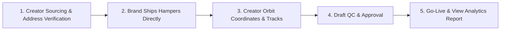

# 🌌 CREATOR ORBIT — Agency Credentials & Pitch Deck

> **Official Document**: Agency Overview, Campaign Packages & Performance Model  
> **Prepared by**: Vedant Rai & Manya Jain (Co-Founders)  
> **Contact**: hello@creatororbit.in | +91-XXXXXXXXXX  

---

## 🎯 1. Who We Are
**Creator Orbit** is a performance-first influencer marketing and creator intelligence agency based in India. We help D2C, e-commerce, and high-growth consumer brands flood social feeds with high-converting creator content at scale.

### Why Brands Work With Us:
```
┌─────────────────────────┬─────────────────────────┬─────────────────────────┐
│   4,300+ DIRECT ROSTER   │   SEAMLESS LOGISTICS    │   END-TO-END EXECUTION  │
│  Verified Indian creators│  Clean dispatch sheets  │  We handle shortlisting,│
│   in Beauty, Fitness,   │  sent to your warehouse │  drafts, follow-ups,    │
│   Fashion & Lifestyle   │  for direct product ship│  and live link tracking │
└─────────────────────────┴─────────────────────────┴─────────────────────────┘
```

---

## 📊 2. Our Creator Network by Numbers

| Metric | Details |
|---|---|
| **Active Creators Managed** | **4,300+** Curated creators across India |
| **Top Niches** | Skincare & Beauty (45%), Fitness & Wellness (25%), Fashion (20%), Food/Lifestyle (10%) |
| **Geographic Coverage** | Delhi NCR, Mumbai, Bengaluru, Pune, Hyderabad, Kolkata, Jaipur, Chandigarh + Tier 2 hubs |
| **Average Organic Views** | **4,000 – 15,000+ views** per creator reel |
| **Turnaround Time** | **7–10 Days** from product dispatch to content going live |

---

## ⚙️ 3. How We Execute Your Campaign (Frictionless Logistics)



1. **Creator Recruitment & Address Verification**: We shortlist matching creators and compile 100% verified shipping addresses, phone numbers, and product variant preferences.
2. **Direct Brand Dispatch**: We deliver a standardized dispatch sheet to your logistics/warehouse team. Your brand ships the product hampers directly to the creators (meaning zero warehousing middlemen markups).
3. **Turnkey Coordination**: Our operations team handles all tracking reminders, delivery confirmations, and creator WhatsApp follow-ups.
4. **Draft QC & Compliance**: Every reel draft is verified against brand guidelines, audio copyrights, and key messaging before going live.
5. **Live Monitoring & Analytics**: We deliver a comprehensive live campaign tracker with post URLs, view counts, engagement rates, and raw UGC asset access.

---

## 💰 4. Campaign Packages for Brands

### 🎁 A. Scalable Barter & Product Seeding Programs (OUR HERO OFFERING)

We offer scalable influencer marketing campaigns tailored to different brand requirements and campaign volumes. All barter packages include **end-to-end creator sourcing, address verification, campaign management, and deliverable tracking**.

```
╔══════════════════════════════════════════════════════════════════════════════╗
║  1. 200+ CREATOR CAMPAIGN (Starter Barter)                                   ║
║  • Campaign Size: 200+ Creators                                              ║
║  • Deliverables per Creator: 1 IG Reel + 1 Story + 1 YT Shorts (where app.)  ║
║  • Average Expected Views: 4K–5K per creator (800K – 1,000,000+ Total Views) ║
║  • Deliverable Management: Full address sheet + tracking + draft QC          ║
║  • Estimated Campaign Budget: ₹2,75,000 – ₹3,00,000 (All-inclusive)          ║
║  • Best for: Product launches & testing creator marketing at scale           ║
╚══════════════════════════════════════════════════════════════════════════════╝

╔══════════════════════════════════════════════════════════════════════════════╗
║  2. 500+ CREATOR CAMPAIGN (Growth Seeding — Most Popular)                    ║
║  • Campaign Size: 500+ Creators                                              ║
║  • Deliverables per Creator: 1 IG Reel + 1 Story + 1 YT Shorts (where app.)  ║
║  • Average Expected Views: 4K–5K per creator (2,000,000 – 2,500,000+ Views)  ║
║  • Deliverable Management: Dedicated operations lead + live dashboard        ║
║  • Estimated Campaign Budget: ₹3,50,000 – ₹4,00,000 (All-inclusive)          ║
║  • Best for: Strong reach, massive UGC content volume & market penetration   ║
╚══════════════════════════════════════════════════════════════════════════════╝

╔══════════════════════════════════════════════════════════════════════════════╗
║  3. 1,000+ CREATOR CAMPAIGN (Viral Category Blitz)                           ║
║  • Campaign Size: 1,000+ Creators                                            ║
║  • Deliverables per Creator: 1 IG Reel + 1 Story + 1 YT Shorts (where app.)  ║
║  • Average Expected Views: 4K–5K per creator (4,000,000 – 5,000,000+ Views)  ║
║  • Deliverable Management: Nationwide dispatch sheet + comprehensive report  ║
║  • Estimated Campaign Budget: ₹9,00,000 – ₹10,00,000 (All-inclusive)         ║
║  • Best for: Large-scale brand awareness, category dominance & viral blitz   ║
╚══════════════════════════════════════════════════════════════════════════════╝
```

> **What We Provide with Every Barter Campaign**:
> * Creator sourcing and shortlisting
> * Campaign strategy and planning
> * End-to-end creator coordination
> * Deliverable management and follow-ups
> * Content tracking and campaign monitoring
> * Performance reporting and campaign insights
> * Dedicated campaign management team

*(Campaign budgets may vary depending on creator category, product value, campaign requirements, timelines, and additional deliverables).*

---

### 💎 B. Curated Paid & Whitelisted Creator Packages (For Targeted Scale)

For brands looking for curated mid-tier creators with guaranteed ad boosting & whitelisting rights:

* **Starter Pilot (Paid)**: 5–7 Curated Creators | 150K–250K Views | **₹35,000 – ₹50,000**
* **Growth Scaler (Paid)**: 12–15 Curated Creators | 450K–750K Views | **₹85,000 – ₹1,25,000**
* **Viral Blitz (Paid)**: 25–30 Curated Creators | 1.2M–2M+ Views | **₹2,20,000 – ₹3,50,000**

---

## 📈 5. Why Direct Seeding Wins

| Factor | Traditional Agency | Creator Orbit |
|---|---|---|
| **Coordination Burden** | Brand has to manage 100+ DMs | **100% turnkey managed by Creator Orbit** |
| **Address Verification** | Messy & prone to return-to-origin | **Clean, phone-verified dispatch sheets** |
| **Creator Follow-ups** | Low deliverable fulfillment | **Strict 7-day draft SLA & follow-up pipeline** |
| **Effective Cost Per View** | ₹0.60 – ₹1.20 | **₹0.15 – ₹0.30** |

---

## 🤝 6. Simple Terms of Engagement

* **Milestone**: 50% Advance upon campaign sign-off; 50% upon deliverable completion & final report.
* **Turnaround Guarantee**: Drafts submitted within 7 days of product delivery to creator.
* **Content Usage**: 90 days organic digital re-use & reposting rights included.

---

## 📞 7. Ready to Launch Your Campaign?

Let’s launch your 200–500 creator product seeding campaign today.

* **Vedant Rai** | Co-Founder, Business & Operations
* **Manya Jain** | Co-Founder, Creator Relations & Strategy
* **Email**: hello@creatororbit.in / vedant@creatororbit.in
* **WhatsApp**: +91-XXXXXXXXXX
* **Location**: New Delhi / Mumbai (Pan-India Service)
